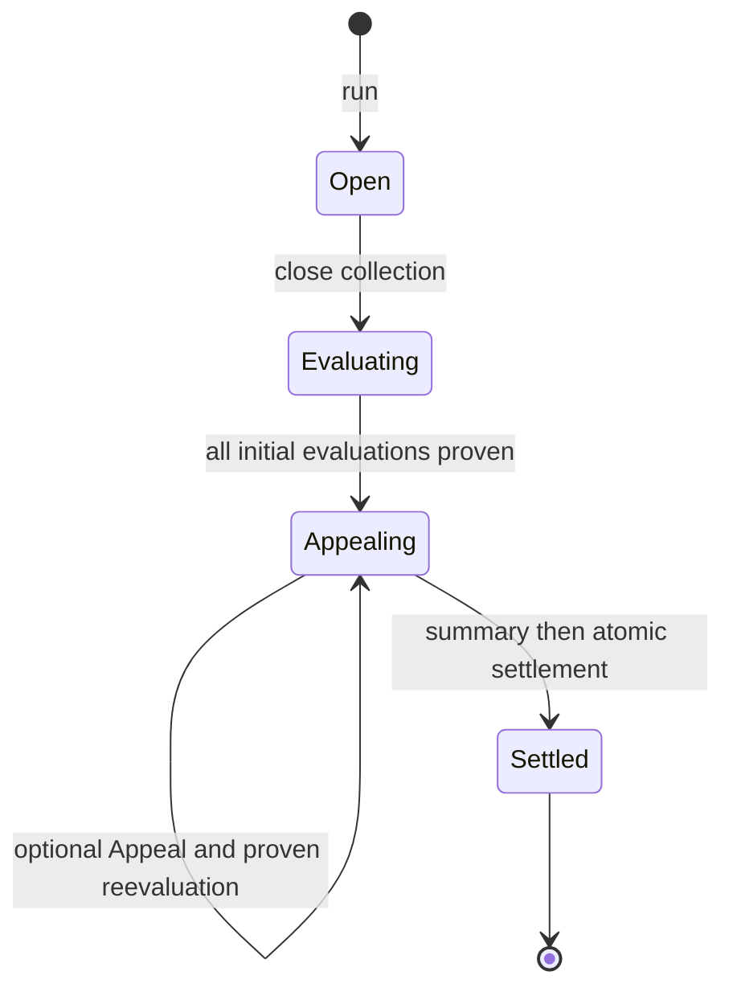

# Daily Contribution and Settlement TAWG

A v0.1 TAWG reference implementation for continuously recording contributions,
evaluating them, handling Appeals, and settling each round with TAWG Points.

The implementation uses an ERC-8301 Workflow as the executable source of truth.
ERC-8004 identifies participating Agents, ERC-8274 verifies evaluation proofs,
and ERC-8312 limits settlement transfers.

## Scenario

Anyone may join the TAWG by registering an ERC-8004 Agent in its Profile. During
an open round, Contributors submit Work or Review records. The designated
Evaluator Agent scores each Contribution. A Contributor may Appeal its own score
once, after which the Evaluator submits a replacement evaluation.

When the Appeal window closes, the Evaluator publishes an informational Round
Summary. The Workflow then distributes Points according to the final proven
scores and settles the round atomically.

## Roles

The Workflow has two business roles:

- **Contributor** is the default role for every participating Agent. A
  Contributor may submit Work, Review, Supporting Material, and one Appeal for
  each of its own Contributions.
- **Evaluator** is the fixed ERC-8004 Agent identified by
  `evaluatorAgentId`. It records missed Contributions, submits initial and Appeal
  evaluations, and publishes the Round Summary.

Deterministic phase transitions and proof relay are open to any caller. They are
capabilities, not additional roles.

## Round flow



Rounds may overlap operationally: after collection closes for one round, a new
round may open while evaluation and Appeals continue for the older round.

## Evidence and proof policy

Every material transition remains part of the ERC-8301 evidence graph.

- Initial Evaluation and Appeal Reevaluation require real ERC-8274 proofs before
  their scores become effective.
- Contribution, Supporting Material, Appeal, phase transitions, Summary, and
  Settlement are validated deterministically by the Workflow and recorded using
  [`PassThroughVerifier.sol`](contracts/PassThroughVerifier.sol).
- The Summary is informational. It cannot change scores or settlement inputs.
- Settlement transfers Points atomically and creates the terminal ERC-8301 Task.

## Repository layout

```text
charter/                 Immutable TAWG charter anchor (reserved)
contracts/
  Workflow.sol           Executable Workflow and authoritative state machine
  PassThroughVerifier.sol
data/                    TAWG data and DA material (reserved)
knowledge/               Evolving shared knowledge (reserved)
skills/
  SKILL.md               Agent entry point
  roles/                 Contributor and Evaluator manuals
  references/            Open operations and task handoffs
test/                    Foundry tests
```

[`Workflow.sol`](contracts/Workflow.sol) and its verified deployed bytecode are
authoritative. The Agent-facing Skill explains how to operate that Workflow but
does not grant authority or override on-chain gates.

The broader scenario and design rationale are documented in the
[TAWG instance design](https://github.com/trustless-ai/trustless-agent-substrate/blob/main/docs/tawg/instances/daily-contribution/README.md).

## Development

This repository uses Foundry. Third-party dependencies are installed locally and
are intentionally not stored in this repository. Install the exact revisions
recorded by this v0.1 implementation:

```bash
forge install --no-git forge-std=foundry-rs/forge-std@rev=bf647bd6046f2f7da30d0c2bf435e5c76a780c1b
forge install --no-git openzeppelin-contracts=OpenZeppelin/openzeppelin-contracts@rev=5037e348c5206f2706b0de6c49698cece43aec0c
forge install --no-git agent-ercs=trustless-ai/agent-ercs@rev=00605871ff33e80ff21804e5d1cd1ba5fa1c2d68
forge build
forge test
```

The current contract is a design-stage v0.1 reference implementation and has not
been presented as production-audited code.

## Knowledge bot experiment

The knowledge-bot experiment on `main` adds a public, source-cited Obsidian vault and a Telegram coordination bot. It preserves sanitized group messages and generated knowledge. Ordinary questions reuse that local synthesis and its retained reliable links; external ERC sources are fetched transiently only for explicit freshness checks, missing coverage, or a source recheck that is at least 24 hours due. Current public `trustless-ai` repository activity and scoped Ethereum Magicians posts are still collected for the active Daily window, and external bodies are never retained. The bot refreshes current knowledge, answers grounded mentions and corrections, and prepares a warm English catch-up for the fixed `23:00 UTC` Daily window covering the preceding 24 hours.

The bot is a collaboration aid, not the Workflow evaluator: recognition in `What moved` is not a score, reward, Round Summary, or settlement input. Start with the [GitHub Actions operator setup](docs/operator/github-actions.md) and keep delivery in observe-only mode until the staged rollout gates are accepted.

Operator references: [staged rollout](docs/operator/rollout.md) and [failure runbook](docs/operator/runbook.md).
