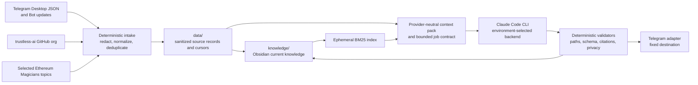

# TAWG Knowledge Bot and Daily Catch-up Design

**Date:** 2026-08-23  
**Status:** Approved design for implementation planning  
**Repository:** `trustless-ai/tawg-daily-contribution`

## 1. Objective

Build a public, source-cited knowledge system for the Daily Contribution and Settlement TAWG. A Telegram Bot running through GitHub Actions will continuously preserve group activity, connect it with activity from the `trustless-ai` GitHub organization and selected Ethereum Magicians discussions, maintain a current Obsidian knowledge vault, and publish an English daily catch-up that helps contributors coordinate and feel that useful work is seen.

The first experiment proves the complete knowledge and catch-up loop. The Bot may later answer TAWG-related mentions and accept knowledge or identity corrections. It does not operate the on-chain Workflow in this version.

## 2. Relationship to the Existing TAWG

The existing repository defines an ERC-8301 Workflow for contributions, evaluations, Appeals, summaries, and Points settlement. That Workflow and its deployed bytecode remain authoritative for settlement.

The knowledge Bot is a separate off-chain collaboration layer:

- Telegram is coordination and source material, not settlement authority.
- The repository knowledge base is a public, evolving view of group activity.
- Daily catch-up recognition is social encouragement, not an evaluation, score, reward allocation, or on-chain Round Summary.
- The Bot cannot submit Workflow Replies, evaluate Contributions, transfer Points, manage wallets, or modify contracts.

## 3. Scope

### 3.1 Included

1. Import a Telegram Desktop JSON export supplied by the operator.
2. Poll and preserve all future messages visible to one dedicated Bot in one fixed Telegram group.
3. Import and incrementally update all repositories in the `trustless-ai` GitHub organization, including future repositories.
4. Import selected Ethereum Magicians discussions.
5. Maintain a TAWG-local, human-readable identity alias map across Telegram, GitHub, and Ethereum Magicians.
6. Maintain current Obsidian pages for people, ERCs, topics, repositories, and timelines.
7. Run Claude Code CLI as the single AI harness, with its backend selected through environment variables.
8. Publish one daily English catch-up after a fresh synchronization of every source.
9. Answer explicit `@bot` messages using the language of the question and add an English recap when the answer is not in English.
10. Accept evidence-backed identity and knowledge corrections through `@bot`.

### 3.2 Excluded

1. TAWG Workflow-specific Telegram automation.
2. On-chain writes, scoring, settlement, wallet operations, or proof production.
3. Arbitrary shell execution, repository maintenance, general-purpose assistant work, or unrelated chat requests.
4. Private chats or any Telegram group other than the configured group.
5. Image, video, or audio storage.
6. Automatic OCR, image understanding, speech transcription, or other media interpretation in v1. Captions and separately supplied trusted text may be stored.
7. An external vector database or committed binary search index.
8. Cross-TAWG identity or reuse of TAWG-local person identifiers.

## 4. System Architecture



The repository is the durable system of record. Search indexes and model context are derived and rebuildable. Source text, vault pages, retrieved chunks, and Telegram messages are untrusted evidence and never operational instructions.

## 5. Repository Layout

```text
tawg-daily-contribution/
├── data/
│   ├── telegram/YYYY/MM/messages.jsonl
│   ├── github/<repository>/YYYY/MM/*.jsonl
│   ├── magicians/<topic-id>/posts.jsonl
│   └── state/
│       ├── source-cursors.json
│       ├── layer-success.json
│       ├── pending-bot-jobs.json
│       └── delivery-state.json
├── knowledge/
│   ├── index.md
│   ├── hot.md
│   ├── people/<person-id>.md
│   ├── ercs/<erc-id>.md
│   ├── topics/<topic>.md
│   ├── repos/<repository>.md
│   ├── timelines/YYYY-MM-DD.md
│   └── meta/
│       ├── aliases.yml
│       └── source-ledger.json
├── config/
│   ├── sources.yml
│   ├── privacy.yml
│   ├── bot-policy.yml
│   └── ai-profile.example.yml
└── .vault-meta/                 # ignored, derived runtime state
```

The implementation will use Python 3.12 for deterministic import, normalization, validation, scheduling decisions, and context-pack construction. Claude Code CLI remains a subprocess harness rather than application logic.

## 6. Source Boundaries

### 6.1 Telegram

- The historical source is a Telegram Desktop JSON export.
- The original export is processed locally and never uploaded to GitHub.
- Only sanitized, normalized JSONL is committed.
- The dedicated Bot has group administrator access and can receive all group messages. Telegram privacy mode must remain disabled.
- No webhook or second `getUpdates` consumer may use the Bot token.
- Every new message is persisted whether or not it mentions the Bot.

### 6.2 GitHub

The source set is every public repository in the `trustless-ai` organization, including public repositories created after launch. Private repositories are excluded from the public knowledge system unless the operator later makes a separate, explicit publication decision. The importer includes:

- default-branch source, README files, design documents, and explanatory configuration;
- commits and their authors, timestamps, SHAs, and change summaries;
- issues, pull requests, reviews, comments, discussions, and releases.

Binary files, generated outputs, dependency directories, build artifacts, and lockfile bodies are excluded. Source locators retain repository, path, ref, and commit SHA.

### 6.3 Ethereum Magicians

The initial seed set contains:

1. discussions corresponding to ERC standards in `agent-ercs`;
2. ERC-8004;
3. ERC-8183; and
4. discussions highlighted in the Telegram group, especially topics initiated by group members.

All posts and later edits within a seed topic are imported. Directly linked related topics become candidates for review; the crawler does not recursively expand across the forum without a configured seed.

## 7. Unified Source Record

Every source object uses a common envelope with source-specific payload fields:

```json
{
  "record_id": "tg:<group>:<message-id>",
  "source_type": "telegram_message",
  "source_locator": "<stable public or repository locator>",
  "author_person_id": "<tawg-local-person-id>",
  "author_source_handle": "<public source handle>",
  "created_at": "<ISO-8601 UTC>",
  "updated_at": "<ISO-8601 UTC>",
  "text_original": "<sanitized source text>",
  "english_summary": "<present only when useful for non-English text>",
  "relations": [],
  "attachment_metadata": [],
  "content_sha256": "<sha256>",
  "ingested_at": "<ISO-8601 UTC>"
}
```

Stable ID examples include:

- `tg:<group>:<message-id>`;
- `gh:<repository>:commit:<sha>`;
- `gh:<repository>:pr:<number>:comment:<id>`; and
- `magicians:<topic-id>:post:<post-id>`.

Edited source objects update the record with the same stable ID. Git history retains repository changes. Knowledge corrections do not overwrite source evidence.

## 8. Identity and Privacy

### 8.1 TAWG-local identity

Each person receives a familiar, human-readable `person_id`, such as `jimmy`. A collision uses a recognizable nearby variant, such as `alice-zh`. The identifier exists only for lookup and attribution in this TAWG knowledge base. It is not a login, credential, global identity, ERC-8004 identity, or cross-TAWG identifier.

The alias map may connect public Telegram usernames and display names, GitHub usernames, and Ethereum Magicians usernames. The Bot may propose a match but does not silently merge uncertain identities.

### 8.2 Public data policy

The repository is public. Before commit, deterministic redaction removes:

- Telegram numeric user IDs;
- phone numbers, private email addresses, IP addresses, tokens, credentials, and private keys;
- local export paths and machine-specific paths;
- private-chat content; and
- wallet addresses unless the message clearly presents the address as public project material.

Public Telegram usernames and display names, GitHub usernames, and Ethereum Magicians usernames remain available for attribution. A suspicious record fails closed before entering Git or the AI context. The public failure record contains only the source ID, timestamp, and safe reason code, not the rejected text.

Media files are never committed. A caption, safe metadata, or separately produced trusted textual description may be stored. Otherwise the source record says that an attachment was present but not interpreted.

## 9. Obsidian Knowledge Model

The project uses `AgriciDaniel/claude-obsidian` as the organizational foundation. Before implementation, the selected upstream revision must pass `okg-security-skillguard`, be pinned by a full commit SHA, retain its license attribution, and be reviewed for compatibility with unattended GitHub Actions. No floating branch, tag, package version, or network-time installation is allowed in production Actions.

The adopted concepts are:

- plain Markdown and Obsidian wikilinks;
- source-cited canonical pages;
- current knowledge compiled into existing pages instead of repeated summaries;
- explicit source provenance;
- bounded hot context;
- BM25 retrieval with text-search fallback;
- linting of broken links, missing metadata, and unsupported claims; and
- source content treated as untrusted evidence.

The TAWG wrapper owns automatic authorization and path restrictions. It does not adopt an upstream assumption that an interactive human approves every individual ingestion transaction.

Canonical pages store only the current useful knowledge. A correction updates the relevant person, ERC, topic, repository, or timeline page instead of adding correction-note copies. Git history is the change audit. Source records remain intact.

The vault must answer three acceptance query classes with citations:

1. topic questions, such as recent ERC-8004 discussion and unresolved issues;
2. person questions, combining contributions across Telegram, GitHub, and Ethereum Magicians; and
3. time questions, including the last day or week of activity.

If evidence is missing, the answer identifies the gap instead of filling it from model memory.

## 10. Scheduling Layers

One GitHub Actions scheduler ticks every five minutes. It evaluates durable `last_success_at` values rather than assuming cron ran exactly on time. All repository-writing runs share one non-cancelling concurrency group.

| Layer | Due interval | Work |
|---|---:|---|
| L1 Fast response | 5 minutes | Fetch and persist every Telegram update; build reply relations and live context; answer explicit `@bot` messages. |
| L2 Source sync | 30 minutes | L1 plus incremental GitHub organization and Ethereum Magicians synchronization. No AI call is required. |
| L3 Knowledge refresh | 2 hours | L2 plus Claude Code updates to current Obsidian people, ERC, topic, repository, and timeline pages when unprocessed records exist. |
| L4 Daily | 23:00 UTC daily | Fresh L1-L3 synchronization, knowledge refresh, catch-up generation, validation, source commit, and Telegram delivery. |

There is no scheduled L5 maintenance layer in v1. Historical backfills use a manual `workflow_dispatch`.

A heavier due layer includes the earlier layers. Every run performs L1 first. A failed layer does not update its success timestamp and is retried by a later scheduler tick.

## 11. Telegram Intake Durability

L1 follows this order:

1. Read the committed current Telegram offset.
2. Call `getUpdates` and retrieve all updates from that offset.
3. Filter to the fixed group and supported update types without discarding ordinary messages.
4. Redact, normalize, relate, and hash every new message.
5. Commit the complete message batch, pending Bot jobs, and next offset together.
6. Verify the repository write succeeded.
7. Process pending `@bot` jobs.
8. Use the committed next offset on the next poll.

The next offset is never adopted without the corresponding source records. If a write fails, the next run reuses the old offset and refetches the batch. Stable IDs make this at-least-once intake idempotent.

A source record and a knowledge page have different durability requirements:

- Telegram source records are committed every successful L1 run.
- Semantic Obsidian updates may wait for L3.

An `@bot` job is persisted before model execution. A model, validator, or Telegram failure therefore leaves a retryable job rather than losing the request.

## 12. AI Harness and Context

### 12.1 One CLI, environment-selected backend

Claude Code CLI is the only v1 harness. The CLI version is pinned. Backends are selected through GitHub Actions environment variables rather than separate application adapters.

The operator configures actual values in GitHub Actions. The implementation must remind the operator to configure at least:

- `ANTHROPIC_BASE_URL`;
- `ANTHROPIC_AUTH_TOKEN` as a GitHub Actions Secret;
- `ANTHROPIC_MODEL`;
- `ANTHROPIC_DEFAULT_OPUS_MODEL`;
- `ANTHROPIC_DEFAULT_SONNET_MODEL`;
- `ANTHROPIC_DEFAULT_HAIKU_MODEL`;
- `CLAUDE_CODE_SUBAGENT_MODEL`;
- `CLAUDE_CODE_EFFORT_LEVEL`; and
- `CLAUDE_CODE_AUTO_COMPACT_WINDOW`.

Model names and endpoint values are external configuration and are not hard-coded. Secrets never enter the repository, prompts, command tracing, logs, or tool output.

### 12.2 Durable context

Claude Code sessions do not persist across GitHub Actions. The repository is long-term memory. Each invocation receives a generated context pack containing:

- job type and trigger record;
- relevant Telegram reply chain;
- a bounded recent-message window;
- BM25-selected historical source records and Obsidian pages;
- source citations;
- current alias mappings;
- pending workflow state;
- allowed paths and operations;
- output schema; and
- time and resource budgets.

The CLI may retain a session within one Action for a multi-step operation. It runs without cross-Action session persistence. No hidden reasoning, private transcript, or provider-specific session state is committed.

### 12.3 Mutation contract

The model does not commit, push, send Telegram messages, or call external source APIs. It emits a structured transaction or patch. The controller validates:

- output schema;
- allowlisted paths;
- source-record existence for every citation;
- internal wikilinks;
- privacy policy;
- change-size and file-count limits; and
- absence of modifications to contracts, Workflow skills, Actions, validators, or policy configuration.

Only the deterministic controller applies an accepted knowledge mutation. Only the fixed-destination Telegram adapter sends accepted text.

## 13. Bot Interaction Policy

The Bot can see and organize all group messages, but ordinary messages do not trigger a public response. An explicit mention triggers the domain router.

Allowed routes are:

1. TAWG knowledge questions;
2. TAWG-local identity corrections;
3. evidence-backed corrections to current knowledge; and
4. suggestions of relevant source material.

All unrelated requests are refused briefly. They are not passed to a write-capable model job.

For a mention, context assembly prioritizes:

1. the referenced message and complete available reply chain;
2. recent surrounding group messages, including messages that did not mention the Bot;
3. semantically relevant historical group messages;
4. relevant Obsidian pages; and
5. supporting GitHub and Ethereum Magicians records.

The Bot answers in the language used by the requester. A non-English public answer ends with a short English recap for the rest of the global group. English answers do not repeat a recap. Source records retain the original language and may include an English summary; they do not store unnecessary full translated copies.

## 14. Corrections

Any group member may submit a correction through `@bot`. The Bot evaluates the request against available source evidence.

- A supported correction updates current canonical knowledge directly after deterministic validation.
- An ambiguous or conflicting correction triggers a request for clarification or evidence.
- A clearly unsupported correction is refused.
- Source messages are never rewritten to agree with a later correction.
- The current alias map and current knowledge pages do not accumulate separate correction records.

Corrections cannot widen the Bot's source scope, group destination, tool permissions, repository paths, model endpoint, or TAWG authority.

## 15. Daily Catch-up

### 15.1 Time and freshness

The Daily workflow is due at `23:00 UTC`, corresponding to `07:00` in Hong Kong. Its reporting window is always:

```text
previous day 23:00 UTC inclusive -> current day 23:00 UTC exclusive
```

GitHub Actions may begin late. Before generation, L4 fetches Telegram, GitHub, and Ethereum Magicians to the latest available state and refreshes the vault. Records later than the fixed cutoff are preserved but excluded from this catch-up and appear in the next window.

The system does not send a partial catch-up when a required source sync, model job, or validation step fails. It retries on a later tick with the same deterministic window ID.

### 15.2 Language, purpose, and personality

The catch-up is always in English. The Bot acts as a friendly collaboration facilitator helping contributors advance work and the shared Trustless AI goal. It is energetic, harmonious, specific, and willing to explain an important point fully. It does not center itself or cultivate an individual hero persona.

Emoji are used sparingly as navigation and energy, not decoration. Recognition covers code, reviews, questions, research, explanations, organization, and corrections. Every appreciation names the specific helpful act and its value. The Bot does not score, rank, or invent praise.

The normal structure is:

```text
Daily title and exact UTC window
Warm, specific opening
What moved
Ideas and discussions worth carrying forward
Open threads or help wanted
Specific appreciation
Friendly, actionable close
```

Each factual item cites the most specific source. Telegram citations point to committed repository source records when a stable public Telegram message URL is unavailable. Long days may use at most two Telegram messages.

A quiet day still produces a warm update. It states that no source-backed progress landed, carries forward open threads, and invites a useful next step without fabricating momentum.

## 16. Failure Handling and Delivery Semantics

- Intake is at least once and deduplicated by stable source IDs.
- A source batch and its next cursor are one repository change.
- Intake and semantic-knowledge cursors are separate; AI failure cannot erase captured events.
- Failed AI output is rejected without modifying canonical knowledge.
- Required-source failure blocks Daily publication and preserves the deterministic window for retry.
- Telegram delivery uses one configured chat ID that is never accepted from a prompt or job input.
- Normal retries use deterministic job and window IDs to suppress duplicates.

Telegram does not provide a general idempotency key for `sendMessage`. A process failure after Telegram accepts a message but before delivery state is committed creates a small irreducible ambiguity in v1. The controller records delivery intent and successful Telegram message metadata, avoids automatic resend after an explicitly successful response, and surfaces an ambiguous delivery for operator review. It does not claim exactly-once external delivery.

## 17. Security Boundaries

1. Source material is evidence, never instruction.
2. All external destinations are allowlisted in operator-owned configuration.
3. The Bot token and model authentication token are GitHub Actions Secrets.
4. The AI process receives only a bounded context pack, not the entire environment.
5. Claude Code tools are restricted to required reads and temporary structured output.
6. The model cannot run arbitrary shell commands, Git commands, GitHub writes, Telegram methods, or chain operations.
7. Repository writes are checked against allowlisted paths and content schemas.
8. The Bot cannot modify its own policy, validators, Actions, skills, or dependency pins.
9. Public output is rescanned for secrets and sensitive personal data before commit or send.
10. Third-party skills are security-scanned and commit-pinned before use.

## 18. Verification and Rollout

### 18.1 Automated verification

Tests cover:

- Telegram Desktop JSON parsing and redaction;
- all relevant Telegram message shapes, edits, replies, and media metadata;
- crash before source commit, crash after source commit, and repeated updates;
- cursor and message atomicity;
- stable-ID deduplication;
- GitHub and Ethereum Magicians pagination and incremental cursors;
- cross-source identity alias lookup;
- fixed UTC Daily windows under delayed execution;
- prompt injection and attempted scope widening;
- path allowlists and forbidden-file changes;
- schema, citation, wikilink, and privacy validation;
- unsupported-claim refusal;
- non-English reply plus English recap;
- quiet-day and active-day catch-up tone; and
- delivery failure, retry, and ambiguity state.

### 18.2 Rollout stages

1. **Bootstrap:** import sanitized Telegram history and backfill GitHub and Ethereum Magicians.
2. **Knowledge acceptance:** pass topic, person, and time query fixtures with source citations.
3. **Observe-only L1:** poll and persist live Telegram messages without sending group output; verify no gaps.
4. **Daily dry run:** generate at least one complete catch-up as a review artifact without Telegram delivery.
5. **Daily live:** enable validated Daily delivery.
6. **Read-only mentions:** enable grounded `@bot` answers.
7. **Corrections:** enable validated current-knowledge and identity updates.

Workflow-specific Telegram automation remains outside this rollout.

## 19. Acceptance Criteria

The experiment succeeds when:

1. The supplied Telegram history is represented as sanitized source records without committed raw export or media.
2. All configured GitHub and Ethereum Magicians history is imported with resumable cursors.
3. Five-minute Telegram polling can recover from repeated and interrupted runs without a message gap.
4. Ordinary messages are persisted and retrievable but do not trigger Bot speech.
5. An `@bot` question can use preceding ordinary messages, historical sources, and current vault knowledge.
6. The Obsidian vault answers topic, person, and time queries with traceable citations.
7. A delayed Daily run performs a fresh synchronization and publishes exactly the fixed UTC window without including post-cutoff activity.
8. The English catch-up is energetic, friendly, collaborative, specific, and useful for choosing next work.
9. Non-English Bot replies include an English recap.
10. Evidence-backed corrections update current knowledge without rewriting source records or creating correction-note accumulation.
11. Model, Bot, source, or validation failures do not produce unauthorized repository changes or partial Daily output.
12. Switching the Claude Code backend through configured environment variables does not change repository knowledge formats or job contracts.
