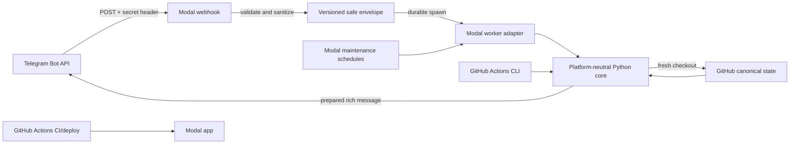

# TAWG Modal Webhook Runtime Design

Date: 2026-08-27

Status: proposed for implementation

## 1. Goal

Move the production TAWG bot runtime from a five-minute GitHub Actions polling loop to Modal so Telegram mentions can be handled promptly, while keeping GitHub as the canonical knowledge, state, and audit store.

The target runtime has two execution paths:

1. Telegram updates enter through a short-lived Modal web endpoint and are handed to a durable background worker.
2. Time-based maintenance remains on Modal schedules for Daily generation, source refresh, retries, reconciliation, and health checks.

GitHub Actions remains responsible for CI, deployment, and an operator-triggered fallback. It is no longer the primary production scheduler after cutover.

## 2. Non-goals

- Do not move canonical bot state to a Modal Volume, database, or queue.
- Do not make business logic depend on Modal. Modal is a deployment and invocation adapter around the same Python core used by GitHub Actions.
- Do not expose a general public bot API.
- Do not make Telegram delivery depend on a long-running HTTP request.
- Do not change the existing knowledge governance, evidence, citation, privacy, or delivery contracts.
- Do not enable the Telegram webhook or disable the existing polling schedule before shadow verification passes.
- Do not run paid reply models for deployment tests; only real production jobs may invoke them.

## 3. Approaches considered

### A. Run the existing tick unchanged on Modal

This is the smallest migration, but it retains five-minute polling latency, consumes scheduled executions even when idle, and does not gain the reliability properties of Telegram webhooks.

### B. Sanitized webhook plus a single-writer repository worker

The web endpoint authenticates Telegram, validates the configured group, converts the update into a privacy-safe envelope, and durably spawns a background worker. The worker checks out current `main`, idempotently records the update, processes actionable reply jobs, and commits only allowlisted state paths.

This is the selected approach. It improves latency without changing the repository-of-record model.

### C. Move runtime state to Modal storage

A Modal Volume or database would simplify concurrent workers, but it would create two sources of truth or require a larger state migration. It is intentionally deferred.

## 4. Components

### 4.1 Modal web endpoint

The Telegram endpoint is public because Telegram cannot attach Modal proxy authentication. It authenticates each request using Telegram's `X-Telegram-Bot-Api-Secret-Token` header and a Modal secret. Comparison is constant-time.

The endpoint:

1. accepts only `POST` requests with a bounded JSON body;
2. validates the secret header before parsing or logging content;
3. validates the configured Telegram chat without retaining its numeric ID;
4. converts the update to a sanitized envelope;
5. durably dispatches that envelope with `Function.spawn()`; and
6. returns success only after Modal accepts the background input.

It does not clone the repository, call a model, write GitHub, or send a Telegram message. This keeps it comfortably inside Modal's web-function timeout.

Invalid authentication receives a generic response. Valid but unsupported update types are acknowledged without spawning work so Telegram does not retry them. Every supported message from the configured group is dispatched and ingested for conversational context, even when it does not mention the bot; only mentions and commands create reply jobs.

### 4.2 Sanitized webhook envelope

Raw Telegram updates must not be passed as Modal background-function arguments because Modal may persist function inputs. They must not be written to application logs either.

The endpoint creates a versioned, minimal envelope containing only fields needed by the existing bot contracts:

- `update_id`;
- stable public source identity derived from the configured group and Telegram message ID;
- message ID, edit state, timestamp, thread ID, and reply-to message ID;
- privacy-inspected text or caption;
- public username or privacy-inspected display alias;
- bot mention/command classification inputs;
- safe attachment metadata required by current ingestion;
- schema version and an integrity digest over the normalized content.

Numeric Telegram user IDs and chat IDs are used only for immediate validation or alias lookup and are removed before dispatch. Unknown private identities follow the existing pseudonymization policy. Unexpected fields are discarded.

The normalizer is a pure deterministic module shared by webhook tests and the runtime. It never calls Telegram, GitHub, Modal, or a model.

### 4.3 Repository worker

The background worker is the only normal path that mutates repository state for webhook updates. It:

1. obtains a fresh checkout of `main` in an isolated temporary directory;
2. verifies the envelope schema and integrity digest;
3. idempotently persists the Telegram source record, relations, attachments, and pending reply job;
4. processes up to the existing bounded batch of actionable reply jobs within the reply-phase time budget;
5. delivers prepared replies using the existing Telegram delivery path; and
6. commits and pushes only paths allowed by the existing checkpoint policy.

Modal configuration limits the worker to one active container for normal operation. Repository optimistic concurrency and idempotent record/job keys remain authoritative because overlapping deploy versions or retries can still occur.

Every mutable operation must be replay-safe. A retry may observe that ingestion, preparation, delivery, or persistence already completed and must converge without duplicating a Telegram message.

### 4.4 Scheduled maintenance

Modal schedules replace the primary GitHub Actions cron after cutover:

- Daily generation at the existing configured publication time;
- source refresh and knowledge maintenance at their existing cadence;
- retry/reconciliation for unfinished jobs and delivery uncertainty;
- a lightweight health check that detects stale state or prolonged failure.

Scheduled functions use the same single-writer repository operation boundary. They do not call `getUpdates` while webhook mode is active.

The deployment initially uses no more than the Modal Starter plan's cron allowance. Closely related maintenance tasks may share one scheduled entrypoint and let the existing scheduler decide what is due.

### 4.5 GitHub Actions

GitHub Actions is retained for:

- Ruff, mypy, the full pytest suite, and vault lint;
- Modal deployment after verified changes reach `main`;
- manual fallback and recovery operations.

The existing five-minute workflow remains enabled during shadow validation. At cutover it is changed so scheduled execution no longer consumes Telegram updates or competes with Modal. Manual fallback must explicitly select polling mode and must never run concurrently with an active webhook.

### 4.6 Platform boundary

Modal is a thin wrapper, not a second implementation of the bot.

The platform-neutral Python core owns:

- Telegram update normalization and ingestion;
- routing, retrieval, reply preparation, and validation;
- knowledge refresh and Daily generation;
- job ordering, batching, retries, and idempotency;
- repository checkpoint construction and delivery state transitions; and
- all privacy, citation, correction, persistence, and path gates.

Platform adapters own only invocation concerns:

- the Modal adapter declares the web endpoint, durable spawn, schedules, image, timeout/concurrency settings, and secret injection;
- the GitHub Actions adapter invokes the same core through the existing CLI, supplies environment secrets, and provides polling/manual fallback orchestration.

Core modules must not import `modal`, depend on Modal function objects, read Modal-specific environment variables, or assume a Modal filesystem. Modal-specific dependencies remain optional and isolated in the deployment adapter. The same normalized-envelope ingestion and maintenance entrypoints must be directly callable from Python tests and from the CLI, so GitHub Actions can exercise or operate them without Modal.

## 5. Data flow

For a mention, the expected sequence is:

1. Telegram delivers an update.
2. The endpoint authenticates, sanitizes, and durably spawns the worker.
3. The endpoint acknowledges Telegram.
4. The worker writes the source record and pending job to a fresh checkout.
5. The existing router, retrieval, reply, validation, persistence, and delivery gates run.
6. Repository audit state records both the source update and delivery outcome.

## 6. Ordering and idempotency

Webhook delivery is at-least-once and may be retried or arrive out of order. Webhook mode therefore must not advance a single maximum `telegram_offset` in a way that can skip an earlier update.

Deduplication uses both:

- Telegram `update_id` in a bounded processed-update record; and
- the existing stable source/job keys based on Telegram message identity.

Repeated delivery of the same update is a successful no-op. Edited messages retain the stable message identity and create the same deterministic edit-aware state transition used by intake today.

Fresh pending replies remain ordered before previously failed jobs. A bounded batch may process up to ten actionable jobs, while the total reply phase and each model call remain capped. One job failure must not prevent later jobs in the same batch from being attempted when budget remains.

## 7. Security and privacy

- Store Telegram bot token, webhook secret, Modal authentication, model credentials, configured chat, and GitHub credential only in Modal or GitHub secrets.
- Never put tokens in source files, function arguments, state records, or logs. Telegram API calls necessarily use a tokenized request path, so clients must also prevent the full request URL from appearing in logs or exceptions.
- Never log raw request bodies, Telegram numeric identifiers, authorization headers, or unfiltered exceptions.
- Use exact secret-header authentication with constant-time comparison.
- Enforce the single configured group before accepting content.
- Bound request size, text length, attachment count, and envelope size.
- Run the existing privacy inspector before durable dispatch.
- Pass only sanitized envelopes to durable Modal calls.
- Preserve the existing citation allowlist, exact-once binding, correction authorization, path allowlist, and vault lint gates.
- Use a least-privilege GitHub App installation token where practical. A fine-grained token is an acceptable initial deployment credential only if restricted to this repository and contents write access.
- Avoid shell interpolation of secrets and avoid emitting command environments in diagnostics.

## 8. Failure handling

### Web endpoint failures

- Authentication or schema failures return a generic client error and do not spawn work.
- Temporary Modal dispatch failures return a non-2xx response so Telegram retries.
- Irrelevant but valid updates return success without work.

### Worker failures

- The worker records only safe phase codes.
- Model, validation, persistence, and delivery failures leave jobs retryable under existing rules.
- Git conflicts trigger a fresh-checkout replay; they do not overwrite remote history.
- Delivery uncertainty is reconciled before any resend.
- A poison update cannot block later updates indefinitely.

### Scheduled recovery

The reconciliation schedule searches for pending, failed/retryable, and uncertain-delivery jobs. Alerts are based on safe metadata such as phase code, age, counts, and commit/run identifiers.

## 9. Deployment and cutover

### Phase 1: local deterministic verification

- Test authentication, normalization, privacy stripping, deduplication, out-of-order delivery, worker replay, and batch behavior with fixtures and fake services.
- Run Ruff, mypy, full pytest, vault lint, code review, and security review.
- Do not invoke paid models.

### Phase 2: Modal shadow deployment

- Deploy the app and secrets without changing Telegram's webhook configuration.
- Send a locally generated, signed fixture request that contains no real private identifiers.
- Verify endpoint acknowledgement, durable dispatch, idempotent state handling, safe logs, and scheduled health behavior.
- Keep GitHub Actions polling active during this phase.

### Phase 3: webhook cutover

1. Confirm the deployed commit and Modal app health.
2. Configure Telegram `setWebhook` with the secret token, required allowed updates, and `drop_pending_updates=false`.
3. Confirm webhook status and one real group update reaches the expected repository record and delivery path.
4. Disable the GitHub Actions polling schedule immediately after webhook confirmation so there is exactly one Telegram consumer.
5. Observe retries, latency, state commits, and duplicate-delivery protections.

Webhook configuration is an explicit operator action and is not performed automatically by a normal code deployment.

### Phase 4: rollback

If webhook processing is unhealthy:

1. call `deleteWebhook` with `drop_pending_updates=false`;
2. verify Telegram reports no active webhook;
3. restore the GitHub Actions polling schedule or run the explicit manual fallback;
4. reconcile pending updates and jobs from canonical repository state; and
5. diagnose before attempting another cutover.

At no point may webhook delivery and `getUpdates` polling be intentionally active together.

## 10. Testing requirements

The implementation must add regression coverage for:

- correct, missing, and incorrect webhook secrets;
- constant behavior that does not reveal which validation failed;
- configured-chat filtering;
- numeric user/chat ID removal before `spawn()`;
- privacy-inspected text and alias handling;
- request and envelope size limits;
- duplicate and out-of-order update delivery;
- edited messages and reply/thread metadata preservation;
- worker replay after partial ingestion, preparation, delivery, and Git conflict;
- ten-job bounded batching and phase-budget exhaustion;
- one failed job not blocking later jobs;
- rich-message delivery and long-message splitting;
- webhook mode never calling `getUpdates`;
- scheduled maintenance not consuming webhook updates;
- manual fallback refusing to poll while webhook mode is active;
- core runtime tests and CLI operation succeeding without the Modal package installed;
- Modal and GitHub Actions adapters invoking the same core entrypoints;
- safe logs containing no secrets or numeric Telegram identifiers.

Modal integration tests use fakes or Modal's local execution where possible. They do not require live Telegram, GitHub writes, or paid model calls.

## 11. Operational acceptance criteria

The migration is complete only when:

- CI and all local verification gates pass;
- the shadow endpoint accepts a signed safe fixture and dispatches exactly once;
- a real Telegram mention produces one correctly threaded reply and one audit trail;
- duplicate delivery produces no duplicate reply;
- all current pending jobs resolve or remain safely retryable with an understood reason;
- the GitHub polling schedule is disabled only after webhook confirmation;
- Modal maintenance schedules are visible and healthy;
- rollback is documented and has been dry-run without discarding pending updates; and
- no raw Telegram update, numeric private identity, or credential appears in Modal inputs, logs, or repository state.
